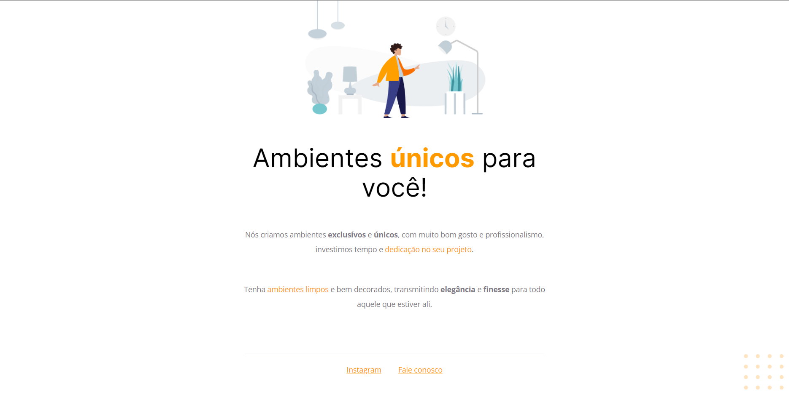

# Projeto 01

Projeto feito pra aula de HTML e CSS do stage 2 da Rocketseat.

## Tecnologias
- HTML  
- CSS  
- Git

## Layout

Você pode visualizar o layout do projeto através [desse link](<https://www.figma.com/file/fAvYZz4dPV5MfhL77XkqkD/Explorer---Projeto-01?type=design&node-id=0-1>).  
É necessário ter uma conta no [Figma](https://www.figma.com).
 

  

